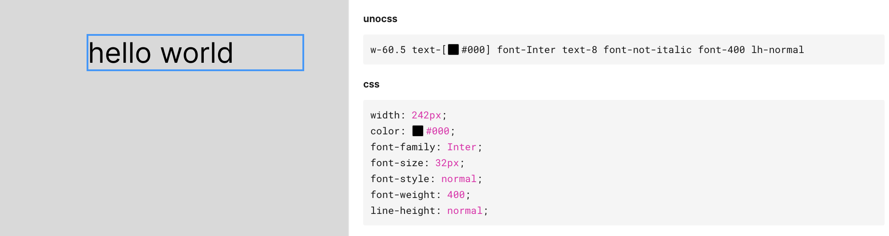

# unocss codegen

> fork from [`tailwindcss codegen`](https://github.com/imranbarbhuiya/figma-tailwindcss)

This plugin generates unocss class names in Figma's dev mode.

No login or other AI stuff.

[Try it today](https://www.figma.com/community/plugin/1309119336695586856)

